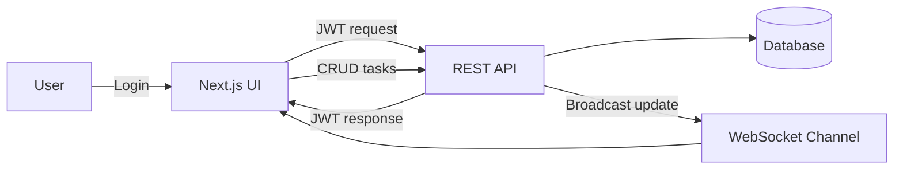
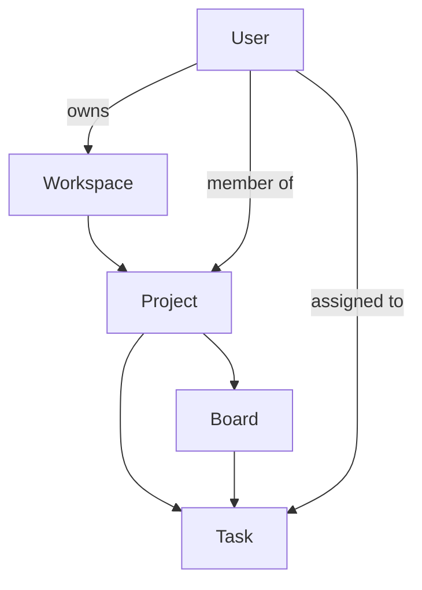

# Enterprise Task Management Platform

A full-stack task management platform built with Django + Django REST Framework + Channels on the backend and a Next.js (App Router) frontend. It supports workspaces, projects, boards, and tasks with real-time task updates over WebSockets.

## Who This Is For

- Engineering and product teams that need a focused, self-hosted task manager.
- Organizations that want a customizable backend with a modern web UI.
- Internal tools teams that need real-time task updates and clear domain boundaries.
- Developers learning to combine Django REST APIs, JWT auth, and WebSockets.

## Core Features

- Workspaces and projects with team membership.
- Kanban-style boards and task tracking.
- Task priority, assignment, and deadlines.
- JWT authentication endpoints.
- Real-time task update broadcasts via WebSockets.

## Tech Stack

- Backend: Django, Django REST Framework, Channels, SimpleJWT, Daphne, SQLite (dev).
- Frontend: Next.js (App Router), React, TypeScript, Tailwind CSS, Zustand.

## Architecture Overview

- REST API under `/api/` for workspaces, projects, boards, and tasks.
- JWT auth endpoints at `/api/auth/token/` and `/api/auth/token/refresh/`.
- WebSocket updates at `/ws/projects/<project_id>/`.

## System Flow Diagrams

### Request + Real-Time Update Flow



### Domain Model Shape



## Local Development

### Backend

1. Create and activate a virtual environment.
2. Install backend dependencies:
   ```bash
   pip install -r requirements.txt
   ```
3. Run migrations:
   ```bash
   python manage.py migrate
   ```
4. Start the backend:
   ```bash
   python manage.py runserver
   ```

### Frontend

From the `frontend` directory:

```bash
npm install
npm run dev
```

Open `http://localhost:3000`.

## Useful Endpoints

- `POST /api/auth/token/` - obtain access + refresh token.
- `POST /api/auth/token/refresh/` - refresh access token.
- `GET /api/workspaces/` - list workspaces.
- `GET /api/projects/` - list projects.
- `GET /api/boards/` - list boards.
- `GET /api/tasks/` - list tasks.

## Project Structure

- `config/` - Django settings, ASGI/WSGI, middleware, and routing.
- `users/` - Custom user model and auth logic.
- `projects/` - Workspace + project domain models and APIs.
- `tasks/` - Boards, tasks, and real-time updates.
- `frontend/` - Next.js app, UI state, and API client.

## Notes

- The development database is SQLite at `db.sqlite3`.
- CORS is enabled for `http://localhost:3000` by default.
